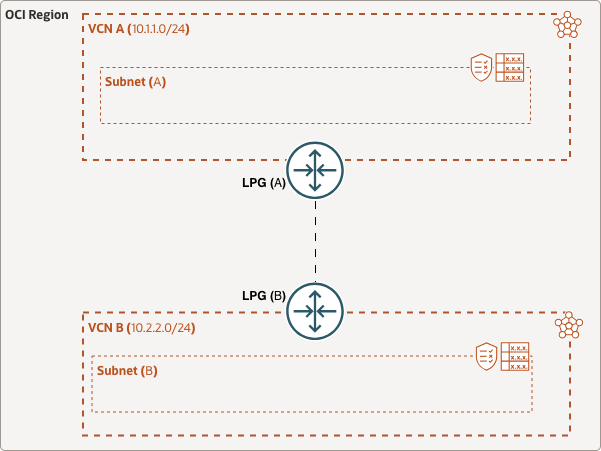

# OCI VCN-to-VCN Connectivity with Local Peering Gateways

## Introduction

This stack provisions two Oracle Cloud Infrastructure Virtual Cloud Networks (VCNs) and connects them through Local Peering Gateways (LPGs). The deployment creates the routing and security components needed for VCN A and VCN B to communicate directly over the peering connection.

## Network Scenario

The Terraform configuration deploys:

- Two VCNs, one for each side of the peering relationship
- One subnet in each VCN
- A route table in each VCN that sends traffic for the peer VCN CIDR to the corresponding LPG
- Security lists that allow traffic from the peer VCN CIDR
- Two LPGs that establish the VCN-to-VCN peering connection

This topology is useful when you need to connect workloads in separate VCNs while keeping the routing and policy model explicit .

## Prerequisites

Before deploying this stack, confirm that you have the following [prerequisites]:

1. An OCI account.
2. A target compartment where the resources will be created.
3. IAM permissions to create VCN, subnet, route table, security list, and LPG resources.
4. Sufficient service limits for the resources being deployed.

## What This Stack Deploys

The Terraform files in this directory include:

1. main.tf - provisions the VCNs, subnets, route tables, security lists, and LPGs.
2. variables.tf - defines the configurable input variables for region, compartment, DNS labels, and CIDR blocks.
3. terraform.tfvars - provides example values for the VCN CIDRs and DNS labels.

## Deployment

We will use **Resource Manager** on the OCI console to deploy the stack.

This stack uses [OCI Resource Manager](https://docs.cloud.oracle.com/iaas/Content/ResourceManager/Concepts/resourcemanager.htm) to make deployment easy, sign up for an [OCI account](https://cloud.oracle.com/en_US/tryit) if you don't have one, and just click the button below:

The code contains following configuration:

1. **_main.tf_**: To provision the core resources required: VCN, subnets, security lists, and load balancers respectively.
2. **_variables.tf_**: To provision the supporting resources required like region, CIDRs, and subnet details respectively. Some variables are configurable such as the region.
3. **_terraform.tfvars_**: Contains variables that will be used for defining specific IPv4 CIDRs. This will be passed to the main.tf configuration.

After logging into the console you'll be taken through the same steps described below:

Step 1 - Check the "I have reviewed and accept the Oracle Terms of Use" checkbox and optionally provide a name for this stack. Select the compartment and Terraform version and click "Next"

Step 2 - Fill out all variables listed (All are required but some have default values provided) and click "Next"

Step 3 - Review the information and click "Create"

Alternatively Please follow these instructions to complete the deployment:

1. Download the existing ZIP file located [here] or download the configuration of the 3 Terraform files (main.tf, variables.tf, & terraform.tfvars). Add these files into a single ZIP file. 
3.	Login to the OCI console and navigate to Developer Services -> Resource Manager -> Stacks.
4.	Create stack by uploading the Terraform ZIP file.
5.	Choose the appropriate compartment. Select Next.
6.	Optionally you pick the specific AD, Compartment, or Tenancy. Enter ‘region’ to deploy VCN, for example, us-ashburn-1.
7.	After creating the stack, click on the stack and click on ‘Plan’ to perform Terraform Plan on the script. This will ensure that you see any errors before applying.
8.	Click on ‘Apply’. This step will deploy all the core networking resources including VCNs, subnets, security rules etc..

For verification or testing, you can create 2 compute VMs and add them as backends to the private load balancers in each of the VCN subnets and test connectivity to them. By default, the front-end load balancer subnet will be set to a public subnet, the backend load balancers will be deployed in private subnets.
## Input Variables

The stack uses the following key inputs:

- tenancy_ocid: Your OCI tenancy OCID.
- region: The OCI region where the resources will be created.
- compartment_ocid: The compartment OCID for deployment.
- vcn_a_dns_label: DNS label for VCN A.
- vcn_b_dns_label: DNS label for VCN B.
- vcn_a_ipv4_cidr_blocks: CIDR blocks for VCN A.
- vcn_b_ipv4_cidr_blocks: CIDR blocks for VCN B.
- subnet_a: CIDR for the subnet in VCN A.
- subnet_b: CIDR for the subnet in VCN B.

The sample values in terraform.tfvars use private RFC1918 ranges and can be modified to fit your network plan.

## Verification

After the deployment completes, verify that:

- Both VCNs exist and have the expected subnets.
- Each route table contains a rule for the peer VCN CIDR that targets the LPG.
- The LPGs are in the Accepted or Peered state.
- Traffic can flow between the two subnets when you place instances in them and test connectivity.

## Cleanup

If you want to delete all the resources, you can perform ‘Destroy’ on the stack. This is a one-step operation.

<!-- Links reference section -->
[changelog]: https://github.com/oracle-terraform-modules/terraform-oci-vcn/blob/main/CHANGELOG.adoc
[contributing]: https://github.com/oracle-terraform-modules/terraform-oci-vcn/blob/main/CONTRIBUTING.adoc
[contributors]: https://github.com/oracle-terraform-modules/terraform-oci-vcn/blob/main/CONTRIBUTORS.adoc
[docs]: https://github.com/oracle-terraform-modules/terraform-oci-vcn/tree/main/docs

[oci]: https://cloud.oracle.com/cloud-infrastructure
[oci_documentation]: https://docs.cloud.oracle.com/iaas/Content/home.htm

[oracle]: https://www.oracle.com
[prerequisites]: https://github.com/oracle-terraform-modules/terraform-oci-vcn/blob/main/docs/prerequisites.adoc

[quickstart]: https://github.com/oracle-terraform-modules/terraform-oci-vcn/blob/main/docs/quickstart.adoc
[here]: https://github.com/oracle-quickstart/oci-vcn-lpg/Resource-Manager
[terraform]: https://www.terraform.io
[terraform_oci]: https://www.terraform.io/docs/providers/oci/index.html
<!-- Links reference section -->