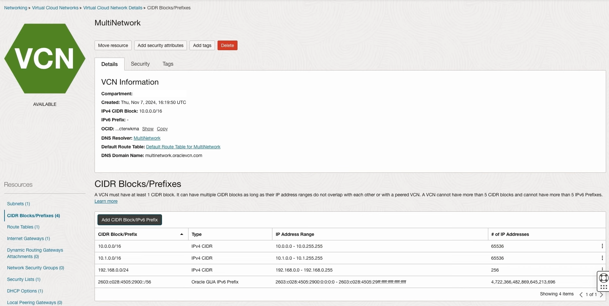

# OCI VCN with Multiple CIDR Ranges

## Introduction

This stack is designed to deploy a Virtual Cloud Network (VCN) with multiple IPv4 and IPv6 CIDRs. This unique VCN feature helps solve different network use cases such as VCN IP CIDR space exhaustion and overlapping IP address space issues.

## Network Scenario

This code will deploy the scenario from the [video] and related [blog].
.

## Prerequisites

The following [prerequisites] are required before deploying this code:
1.	OCI Account.
2.	Target compartment where stack needs to be created and resources need to be deployed.
3.	IAM policies required to provision the resources.
4.	Ensure the service limits allow the deployment of the resources.

## Scope

This code does not deploy:

1.	Compute instances for verification and testing.
2.	Compartments and IAM policies.

## Deployment

We will use **Resource Manager** on the OCI console to deploy the stack.

This stack uses [OCI Resource Manager](https://docs.cloud.oracle.com/iaas/Content/ResourceManager/Concepts/resourcemanager.htm) to make deployment easy, sign up for an [OCI account](https://cloud.oracle.com/en_US/tryit) if you don't have one, and just click the button below:

The code contains following configuration:

1. **_main.tf_**: To provision the core resources required: VCN, subnets, route tables, security lists, and gateways respectively.
2. **_variables.tf_**: To provision the supporting resources required like region, CIDRs, and subnet details respectively. Some variables are configurable such as the region.
3. **_terraform.tfvars_**: Contains variables that will be used for defining specific IPv4/IPv6 CIDRs. This will be passed to the main.tf configuration.

After logging into the console you'll be taken through the same steps described below:

Step 1 - Check the "I have reviewed and accept the Oracle Terms of Use" checkbox and optionally provide a name for this stack. 

Step 2 - Select the compartment and Terraform version and click "Next"

Step 3 - Fill out all variables listed (All are required but some have default values provided) and click "Next"

Step 4 - Review the information and click "Create"

Alternatively Please follow these instructions to complete the deployment:

1. Download the configuration of the 3 Terraform files (main.tf, variables.tf, & terraform.tfvars). Add these files into a single ZIP file. Alternatively, download the existing ZIP file located [here]
3.	Login to the OCI console and navigate to Developer Services -> Resource Manager -> Stacks.
4.	Create stack by uploading the Terraform ZIP file.
5.	Choose the appropriate compartment. Select Next.
6.	Optionally you pick the specific AD, Compartment, or Tenancy. Along with any additional ipv4 CIDR blocks you would like to add (max of 5 CIDRs). Enter ‘region’ to deploy VCN, for example, us-ashburn-1.
7.	After creating the stack, click on the stack and click on ‘Plan’ to perform Terraform Plan on the script. This will ensure that you see any errors before applying.
8.	Click on ‘Apply’. This step will deploy all the core networking resources including VCNs, subnets, security rules etc..

For verification or testing, you can create 2 compute VMs in each of the VCN subnets and test connectivity between them. By default, all subnets will be set to public subnets and will assign public IPs to the VMs deployed.

## Termination

If you want to delete all the resources, you can perform ‘Destroy’ on the stack. This is a one-step operation.

<!-- Links reference section -->
[changelog]: https://github.com/oracle-terraform-modules/terraform-oci-vcn/blob/main/CHANGELOG.adoc
[contributing]: https://github.com/oracle-terraform-modules/terraform-oci-vcn/blob/main/CONTRIBUTING.adoc
[contributors]: https://github.com/oracle-terraform-modules/terraform-oci-vcn/blob/main/CONTRIBUTORS.adoc
[docs]: https://github.com/oracle-terraform-modules/terraform-oci-vcn/tree/main/docs

[blog]: https://www.ateam-oracle.com/post/vcn-with-multiple-cidr-ranges
[video]: https://youtu.be/HV90CTuMXAM

[oci]: https://cloud.oracle.com/cloud-infrastructure
[oci_documentation]: https://docs.cloud.oracle.com/iaas/Content/home.htm

[oracle]: https://www.oracle.com
[prerequisites]: https://github.com/oracle-terraform-modules/terraform-oci-vcn/blob/main/docs/prerequisites.adoc

[quickstart]: https://github.com/oracle-terraform-modules/terraform-oci-vcn/blob/main/docs/quickstart.adoc
[here]: https://github.com/oracle-quickstart/oci-vcn-multiple-cidrs/Resource-Manager
[terraform]: https://www.terraform.io
[terraform_oci]: https://www.terraform.io/docs/providers/oci/index.html
<!-- Links reference section -->
